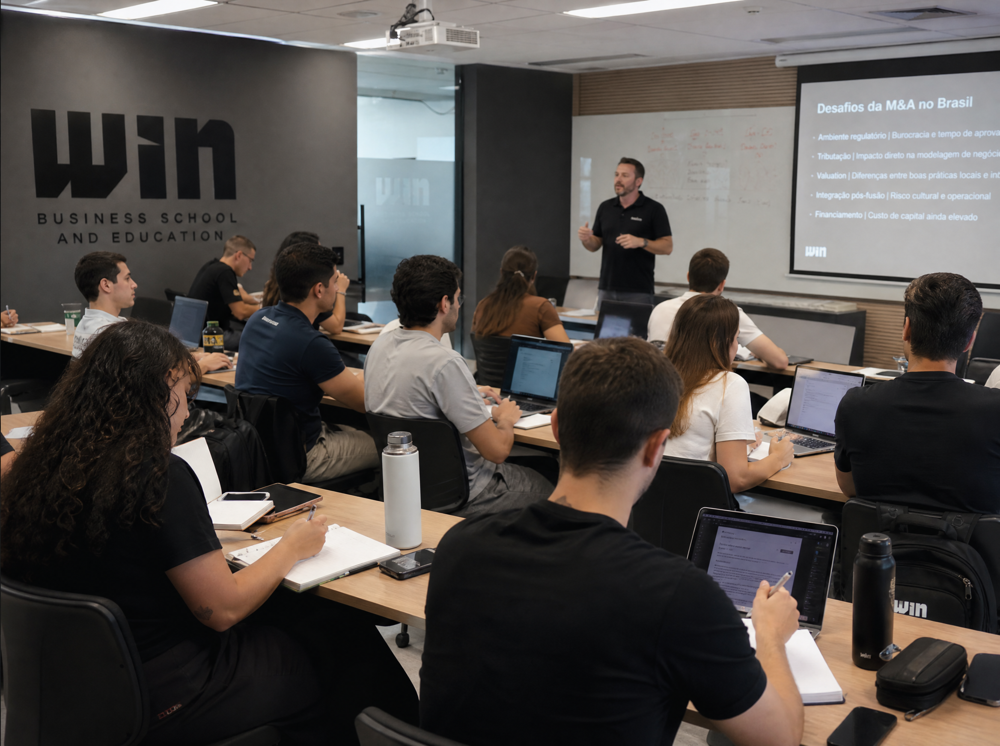

# WIN Future Universitário — Hot-site



Este é o repositório do hot-site **WIN Future Universitário**, uma imersão presencial focada no ensino prático do uso de Inteligência Artificial para alavancar a rotina acadêmica e profissional de estudantes universitários.

O objetivo principal desta landing page é **conversão**: apresentar o valor do evento, mostrar o que muda na prática com o uso de IA e guiar o usuário até o formulário de inscrição.

---

## 🚀 Tecnologias e Stack

Este projeto foi construído utilizando as ferramentas mais modernas do ecossistema Front-end, garantindo alta performance (Lighthouse focado em 90+), SEO técnico otimizado e uma experiência rica e fluida.

- **[Next.js 15](https://nextjs.org/) (App Router)**: Framework React com Server Components e otimização nativa de fontes e imagens.
- **[React 19](https://react.dev/)**: A mais nova versão do React.
- **[Tailwind CSS v4](https://tailwindcss.com/)**: Motor de estilização utilitária de altíssima performance, com configuração simplificada.
- **[Motion](https://motion.dev/) (Framer Motion)**: Biblioteca de animações baseada em física para revelar elementos no scroll e criar micro-interações.
- **[Lucide React](https://lucide.dev/)**: Ícones em SVG limpos e consistentes.
- **TypeScript**: Tipagem estática em 100% da aplicação para prevenir bugs.

---

## 🎨 Design System e Identidade Visual

O design do site reflete a assinatura da marca: *"Pessoas. Ideias. Um futuro mais real."*

- **Dark Mode Nativo**: Uma estética *tech* e imersiva. Cores predominantes: Fundo Quase-Preto (`#05070C`), Superfícies (`#0B0F19`), com detalhes em **Azul Elétrico** (`#1F4FFF` / `#2F6BFF`).
- **Tipografia Editorial**:
  - **Archivo**: (Display) Usada em títulos em CAIXA-ALTA, com peso extra-bold e kerning apertado para passar uma imagem forte e moderna.
  - **Inter**: (Sans) Usada para o corpo de texto, garantindo legibilidade absoluta.
- **Glassmorphism**: Uso extensivo de superfícies translúcidas com `backdrop-blur`, especialmente no mobile, substituindo textos sobrepostos por "badges" flutuantes que destacam a imagem principal.
- **Micro-interações Sênior**:
  - *Reveal no scroll*: Elementos aparecem suavemente em cascata.
  - *Marquees infinitos*: Textos conceituais e cards rolam suavemente na tela usando animações CSS e framer-motion.
  - *Interações táteis*: CTAs e cards com brilhos sutis no hover.

---

## 📁 Estrutura do Projeto

Para manter a base de código escalável e fácil de manter (especialmente na fase de briefing, onde copys podem mudar constantemente), a arquitetura separa *Dados* de *Componentes*.

```text
src/
├── app/                  # Rotas do Next.js (App Router)
│   ├── layout.tsx        # Definição de fontes, layout global e SEO/JSON-LD
│   ├── page.tsx          # Landing page principal
│   ├── globals.css       # Diretivas Tailwind e animações globais (marquees)
│   └── cadastro/         # Nova rota dedicada para o formulário de conversão
├── components/           # Componentes modulares
│   ├── layout/           # Header (navegação), Footer
│   ├── sections/         # Blocos de conteúdo (Hero, O que muda, Ferramentas, etc.)
│   └── ui/               # Componentes atômicos (Botões, Cards, Modais, Toast, Imagem inteligente)
├── content/
│   └── site.ts           # 📄 Fonte da Verdade de todo o texto do site (Central de CMS estático)
├── lib/
│   ├── analytics.ts      # Funções de rastreamento (GA4, Pixel)
│   └── icons.ts          # Mapeamento dinâmico de ícones Lucide
```

> 💡 **Dica de Manutenção**: Se precisar alterar um título, adicionar um item à agenda, trocar uma foto ou mudar o link de inscrição, faça isso alterando **exclusivamente** o arquivo `src/content/site.ts`. Os componentes React renderizam os dados baseados nesse arquivo, evitando o risco de quebrar o layout.

---

## 📋 Resumo do Briefing (Contexto de Negócio)

- **Produto**: Imersão de 1 dia sobre IA.
- **Público-alvo**: Universitários.
- **Data e Local**: 03/10 (Das 09h às 18h) · Belém/PA.
- **Tríade Conceitual**: Conhecimento, Conexão, Ação.
- **Conversão**: Inscrição através de um formulário (`/cadastro`).

### Lacunas e Próximos Passos (A Definir com o Cliente)

Conforme análise do arquivo de Briefing original (`briefing-win-future-universitario.md`), ainda restam alguns itens de conteúdo para aprovação final da equipe de negócios/marketing:

1. **Benefícios, FAQ e "Para quem é"**: As seções estão mapeadas no layout, mas o texto final (*copy*) não foi fornecido.
2. **Cronograma Oficial**: Os módulos na timeline da programação atual estão com placeholders (`[Conteúdo]`).
3. **Endereço Físico**: Atualizar o endereço do local exato do evento em Belém.

---

## 🛠 Como executar localmente

1. Certifique-se de usar o Node.js na versão 20+ e o gerenciador de pacotes `pnpm` (recomendado).
2. Instale as dependências:

   ```bash
   pnpm install
   ```

3. Rode o servidor de desenvolvimento:

   ```bash
   pnpm dev
   ```

4. Acesse `http://localhost:3000` no seu navegador. O Next.js recarregará automaticamente quando você salvar algum arquivo.

---
*Projeto desenvolvido seguindo as melhores práticas de Engenharia Front-end e UI/UX Moderno.*
